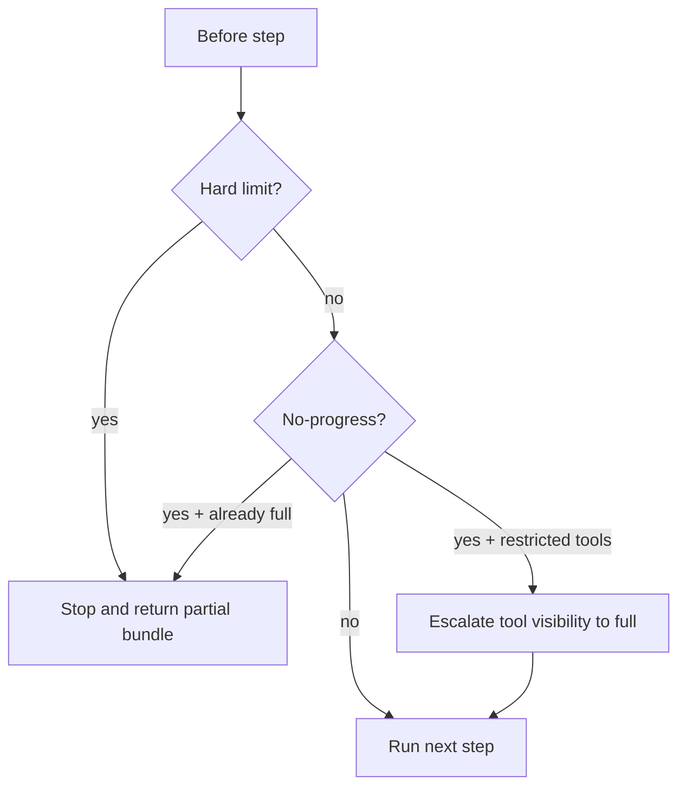

# Agent Limits and Stop Rules

The bounded agent uses hard limits plus no-progress detection.

## Config Surface

```bash
AGENT_MAX_STEPS=15
AGENT_MAX_TOOL_CALLS=20
AGENT_MAX_REPAIRS=2
AGENT_ENABLE_INTENT_ROUTING=true
AGENT_ENABLE_VALIDATION=true
```

## Limit Types

- `MAX_STEPS`: loop iterations reached.
- `MAX_TOOL_CALLS`: total executed tools reached.
- `MAX_REPAIRS`: validation repair attempts reached.
- `NO_PROGRESS_REPEATED`: repeated identical call signatures.
- `NO_PROGRESS_EMPTY`: consecutive empty/failed outcomes.

## Current Runtime Behavior



Important:

- In restricted mode, no-progress first attempts recovery by tool-visibility escalation.
- Escalation events are counted in state (`tool_visibility_escalations_count`).

## APIs

- `LimitChecker.check(state)`: hard limits only.
- `LimitChecker.detect_no_progress(state)`: no-progress only.
- `LimitChecker.should_stop(state)`: compatibility helper.

Controller uses hard/no-progress checks separately to allow escalation before stop.

## Violation Payload

`LimitViolation` includes:

- `limit_type`
- `message`
- `partial_answer_allowed`
- optional `suggestion`

## Operational Guidance

- Keep defaults conservative; tune only with telemetry.
- Prefer solving no-progress with better tool guidance first.
- Avoid raising limits to mask repeated-call loops.

## Test Coverage

Primary tests:

- `tests/agent/test_limits.py`
- `tests/agent/test_controller.py` (runtime behavior)
- `tests/agent/test_tool_visibility_policy.py` (escalation interaction)
