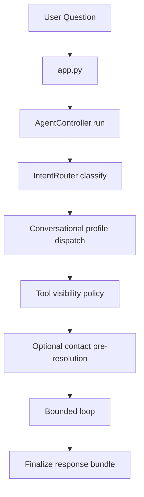
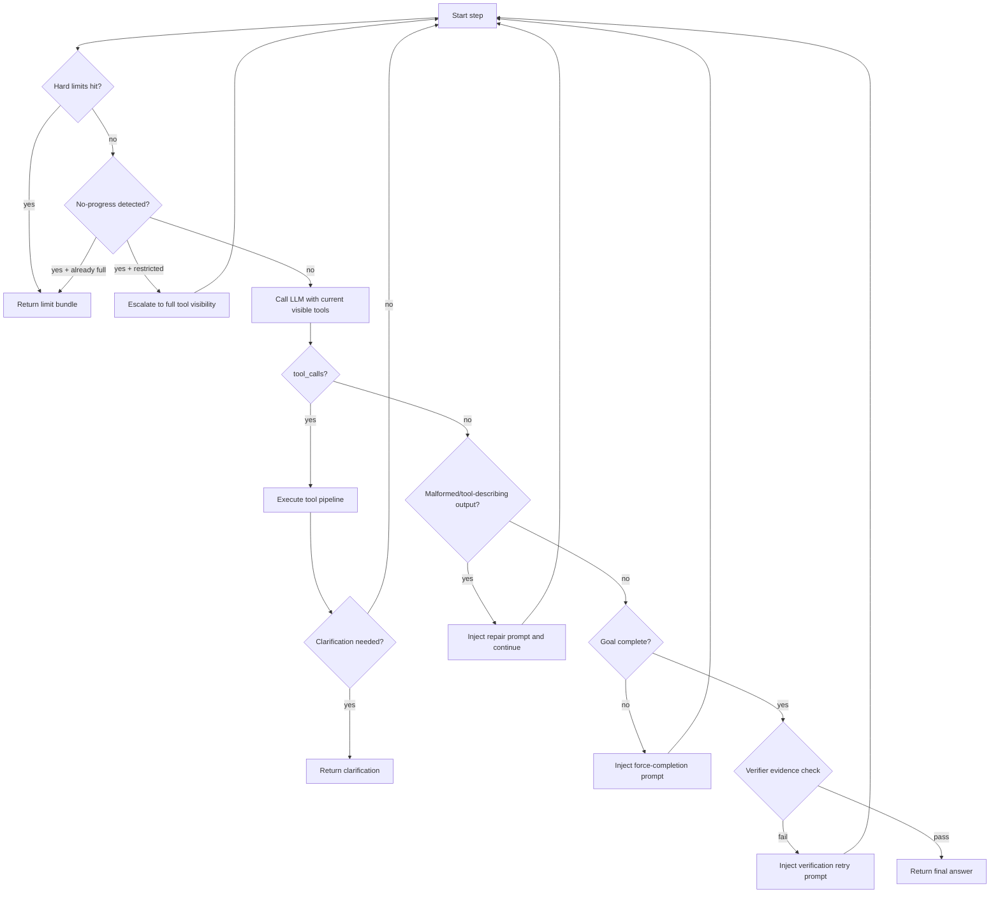
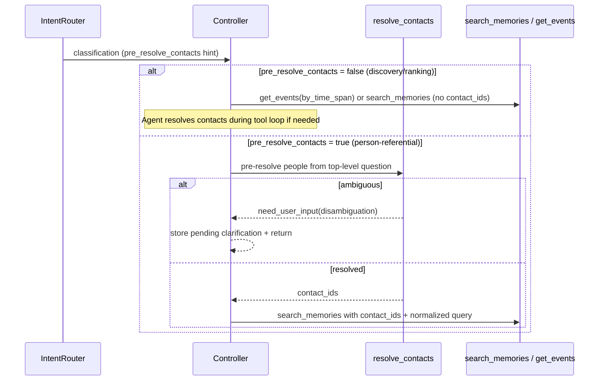

# Main Agent Flow (Current)

This document describes the runtime behavior of the main bounded agent after profile/runtime consolidation.

## Runtime Ownership

- Shared runtime: `backend/orchestrator/agent/*`
- Main-agent policy: `backend/orchestrator/agents/main/*`

## End-to-End Flow

## Detailed Step Flow

## Routing and Visibility Rules

Main controller now applies confidence-tier visibility policy:

- `high` confidence: restrict to routed groups.
- `medium` confidence: routed groups + `resolution`.
- `low` confidence: full tool set.

Escalation policy:

- If restricted mode hits no-progress (repeated/empty), controller escalates to full tools within the same run.
- Escalation is always enabled in runtime policy.

## Conversational Profile Dispatch

- `/ask` and `/ask/stream` are generic endpoints: controller selects conversational profile after routing.
- Mobile `/ask/stream` continues execution after client disconnect. When the run later completes, the backend sends a `chat-reply` push notification with `threadId` and `isMainSession` data so the app can deep-link to `/home` for the main chat or `/chat/[threadId]` for a secondary thread.
- Current mapping:
  - `MEMORY_SEARCH`, `DATA_QUERY`, `CONTACT_LOOKUP` -> `memory_expert`
  - all other intents -> `main`
- Endpoint-specific bounded workflows (for example daily briefing) remain endpoint-owned and do not use this dispatch path.

## Main Policy Modules

- `agents/main/message_builder.py`
  - system/context/state message assembly
  - skill injection
  - cached static prompt blocks (system/protocol/tag/clarification-skill)
- `agents/memory_expert/message_builder.py`
  - memory-focused system/context/state message assembly
  - compact matching-skill injection (without global skill index block)
- `agents/registry.py`
  - intent -> conversational profile selection
- `agents/main/runtime_policy.py`
  - malformed-output classification
  - follow-up prompt selection
  - force-completion prompt generation
  - tool status normalization (`need_user_input` aware)
- `agent/planning_policy.py`
  - execution plan generation
  - final-response verification policy
  - verification retry prompt generation
- `agent/model_routing.py`
  - always-on adaptive model/timeout selection
  - complexity + runtime-signal based routing

## Contact-Aware Memory Flow

### Pre-resolution decision policy

The LLM router prompt instructs the model to set `pre_resolve_contacts=true` only when the query references a specific person by name, pronoun, or relationship term. Discovery/ranking queries (e.g. "who did I meet most this week?") get `pre_resolve_contacts=false` so the agent can use `get_events(by_time_span)` to retrieve raw interaction data and rank counterparts itself. Rule-based routes use the intent-level default from `INTENT_PRE_RESOLVE_CONTACTS`.

For a straightforward contact name/identity question, the goal validator may accept the final answer without a retrieval tool call when it contains the display name of a high-confidence controller-pre-resolved contact. This shortcut does not cover phone, email, address, or other contact details; those still require retrieval.

### Contact resolution latency policy

- Pre-resolution and agent `resolve_contacts` tool calls run the resolver in `minimal` mode.
- `minimal` mode stops after mention extraction, deterministic selector resolution, direct contact resolution, and ambiguity detection; it skips profession inference and relationship-suggestion enrichment.
- The resolver now attempts a deterministic short-circuit before LLM extraction for straightforward cases like exact names, `my <relationship>` phrases, and deterministic group selectors.
- Explicit user statements that a named person is a new contact or absent from the database are treated as hard signals before fuzzy matching, so weak single-candidate matches cannot replace the new contact.
- Contact-resolution prompt context is tiered: hard user rules are loaded first, while soft user facts are deferred to ambiguity/disambiguation prompts.

## Background Work After Chat Responses

- The router emits `should_generate_facts` for LLM-classified messages. High-confidence rule-based routes set it to `false`; LLM routes set it to `true` only for durable first-person facts and `false` for questions, requests, third-party statements, and transient details.
- Fact extraction runs through the existing background callback only when the route has not explicitly declined it. A `true` signal bypasses the short-message heuristic; an absent signal retains the legacy heuristic as a fallback.
- New-thread title generation runs as a FastAPI background task after exchange persistence. Other async entry points use a detached worker thread. The generated title is written only while the database title is still a default, preserving user renames.

## Clarification Behavior

- Clarification is returned immediately when pending contact disambiguation or UI form follow-up is required.
- Clarification payloads are normalized to `need_user_input` standards and can produce `clarification_form` UI directives.

## Streaming Path

`run_stream` mirrors the same decision policy and emits:

- `status`
- `token`
- `tool_call`
- `tool_result`
- `done`

Streaming uses the same limit checks, escalation policy, clarification checks, and malformed-output recovery logic.

## Observability Fields

Main run metadata includes:

- `profile`
- `route_source`
- `route_confidence`
- `route_confidence_tier`
- `tool_visibility_mode`
- `tool_visibility_escalated`
- `tool_visibility_escalations_count`
- `clarification_requests_count`
- `execution_plan_steps`
- `execution_plan_completed_steps`
- `verifier_notes`
- `llm_routing_profile`
- `llm_routing_model`
