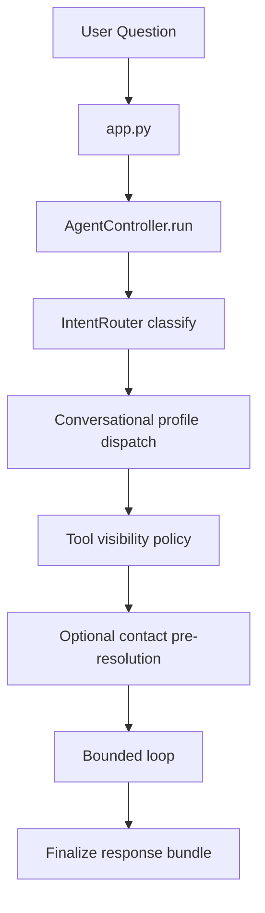
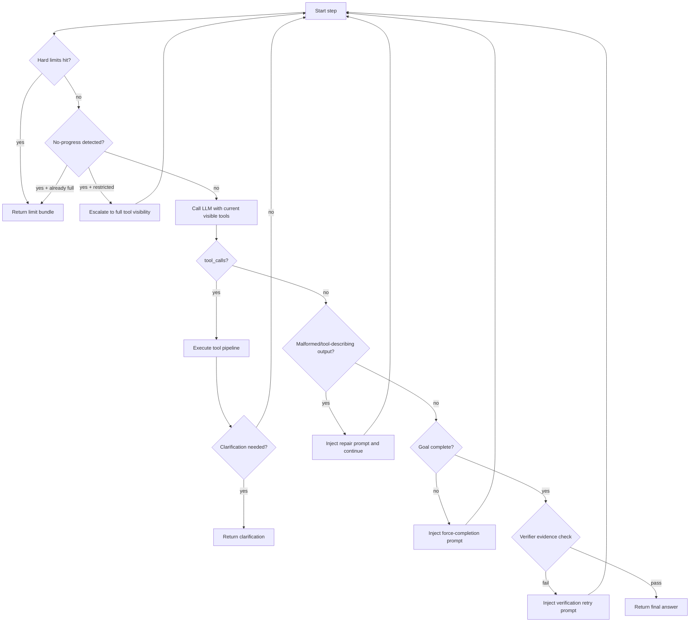
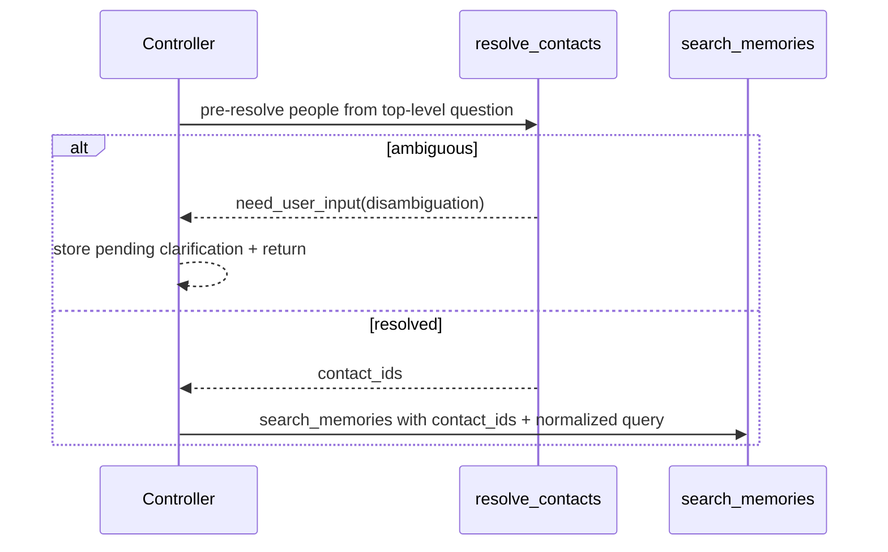

# Main Agent Flow (Current)

This document describes the runtime behavior of the main bounded agent after profile/runtime consolidation.

## Runtime Ownership

- Shared runtime: `backend/orchestrator/agent/*`
- Main-agent policy: `backend/orchestrator/agents/main/*`

## End-to-End Flow

## Detailed Step Flow

## Routing and Visibility Rules

Main controller now applies confidence-tier visibility policy:

- `high` confidence: restrict to routed groups.
- `medium` confidence: routed groups + `resolution`.
- `low` confidence: full tool set.

Escalation policy:

- If restricted mode hits no-progress (repeated/empty), controller escalates to full tools within the same run.
- Escalation is always enabled in runtime policy.

## Conversational Profile Dispatch

- `/ask` and `/ask/stream` are generic endpoints: controller selects conversational profile after routing.
- Current mapping:
  - `MEMORY_SEARCH`, `DATA_QUERY`, `CONTACT_LOOKUP` -> `memory_expert`
  - all other intents -> `main`
- Endpoint-specific bounded workflows (for example daily briefing) remain endpoint-owned and do not use this dispatch path.

## Main Policy Modules

- `agents/main/message_builder.py`
  - system/context/state message assembly
  - skill injection
  - cached static prompt blocks (system/protocol/tag/clarification-skill)
- `agents/memory_expert/message_builder.py`
  - memory-focused system/context/state message assembly
  - compact matching-skill injection (without global skill index block)
- `agents/registry.py`
  - intent -> conversational profile selection
- `agents/main/runtime_policy.py`
  - malformed-output classification
  - follow-up prompt selection
  - force-completion prompt generation
  - tool status normalization (`need_user_input` aware)
- `agent/planning_policy.py`
  - execution plan generation
  - final-response verification policy
  - verification retry prompt generation
- `agent/model_routing.py`
  - always-on adaptive model/timeout selection
  - complexity + runtime-signal based routing

## Contact-Aware Memory Flow

## Clarification Behavior

- Clarification is returned immediately when pending contact disambiguation or UI form follow-up is required.
- Clarification payloads are normalized to `need_user_input` standards and can produce `clarification_form` UI directives.

## Streaming Path

`run_stream` mirrors the same decision policy and emits:

- `status`
- `token`
- `tool_call`
- `tool_result`
- `done`

Streaming uses the same limit checks, escalation policy, clarification checks, and malformed-output recovery logic.

## Observability Fields

Main run metadata includes:

- `profile`
- `route_source`
- `route_confidence`
- `route_confidence_tier`
- `tool_visibility_mode`
- `tool_visibility_escalated`
- `tool_visibility_escalations_count`
- `clarification_requests_count`
- `execution_plan_steps`
- `execution_plan_completed_steps`
- `verifier_notes`
- `llm_routing_profile`
- `llm_routing_model`
