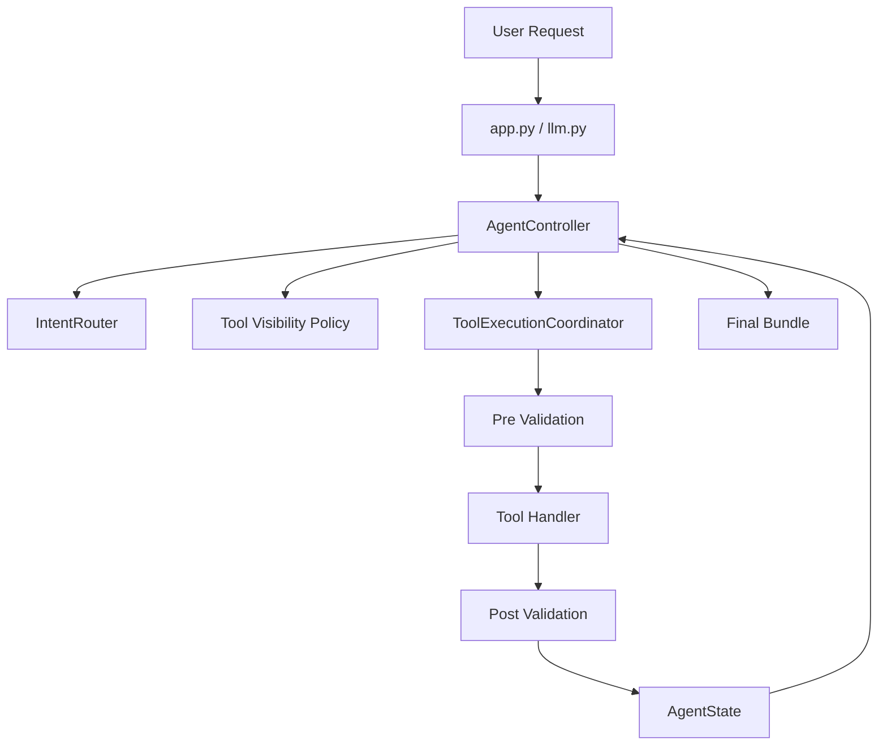
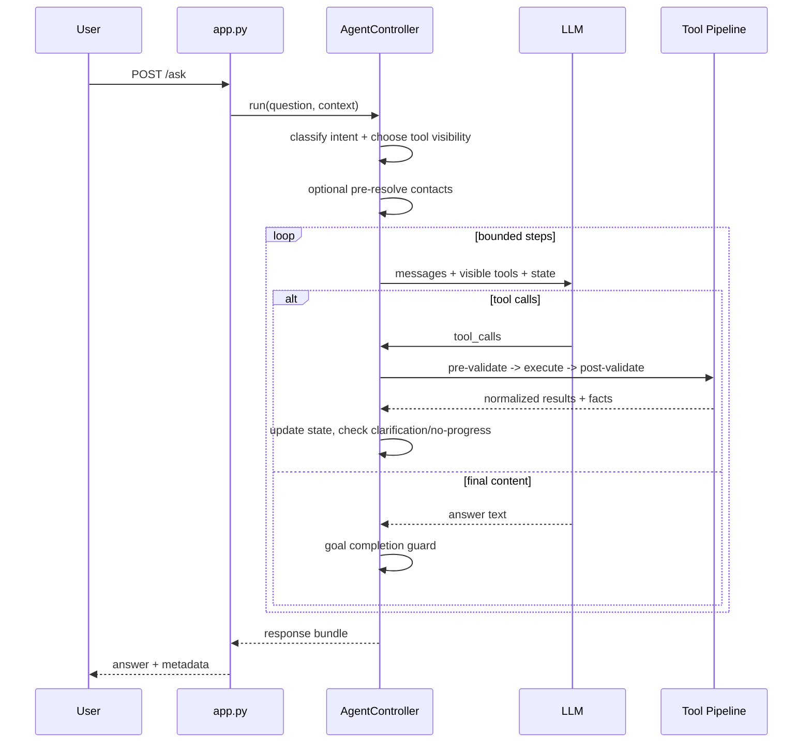

# Bounded Agent Architecture Overview

## Core Principle

**"The model proposes, the controller validates and decides."**

The LLM suggests actions, but the runtime enforces contracts, validates tool usage, and decides whether to continue, escalate, clarify, or stop.

## Runtime Layers

## Profile-Based Design

The architecture is split into shared runtime and agent-specific policy:

- `backend/orchestrator/agent/`: shared runtime primitives (controller, limits, state, visibility policy, execution pipeline).
- `backend/orchestrator/agents/main/`: main conversational agent policy (message building, runtime policy, profile config).
- `backend/orchestrator/agents/daily_briefing/`: daily briefing profile, bounded tool policy, and executor integration.

## Routing and Tool Visibility

Routing is hybrid and conservative:

1. High-precision deterministic rule short-circuit when confidence is high.
2. LLM routing for open/ambiguous language.
3. Confidence-tiered tool visibility:
   - `high`: restrict to routed groups.
   - `medium`: routed groups + `resolution`.
   - `low`: full toolset (fail-open).
4. If restricted mode hits no-progress, visibility escalates to full tools in-run.

## Main Request Flow

## Key Files

| File | Purpose |
|------|---------|
| `agent/controller.py` | Main orchestration for sync/stream runs |
| `agent/tool_executor.py` | Tool execution and validation coordinator |
| `agent/tool_visibility_policy.py` | Confidence-tier visibility and escalation policy |
| `agent/state.py` | Canonical runtime state and counters |
| `agent/router.py` | Hybrid intent classification |
| `agents/main/message_builder.py` | Main prompt assembly |
| `agents/main/runtime_policy.py` | Main loop decision helpers |
| `agents/main/profile.py` | Main runtime profile |
| `agents/daily_briefing/profile.py` | Daily briefing bounded profile and tools |
| `agent/tool_loop_runner.py` | Shared bounded tool loop runner utility |

## Important Notes

- Tool groups are now used for runtime visibility policy (not just metadata).
- Clarification responses follow `need_user_input` standards and map to UI directives when possible.
- Controller tracks recovery metrics in state metadata (`tool_visibility_escalations_count`, `clarification_requests_count`).

## Related Docs

- [MAIN_AGENT_FLOW.md](./MAIN_AGENT_FLOW.md)
- [STATE_MANAGEMENT.md](./STATE_MANAGEMENT.md)
- [TOOL_GROUPS.md](./TOOL_GROUPS.md)
- [VALIDATION.md](./VALIDATION.md)
- [AGENT_LIMITS.md](./AGENT_LIMITS.md)
- [ADDING_TOOLS.md](./ADDING_TOOLS.md)
- [ADDING_INTENTS.md](./ADDING_INTENTS.md)
