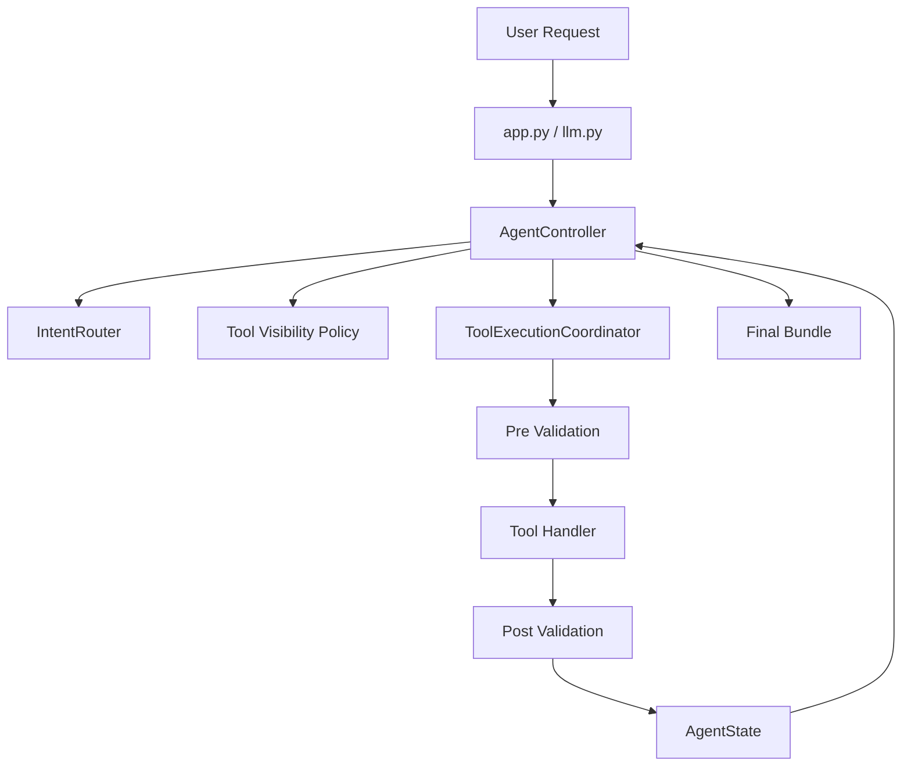
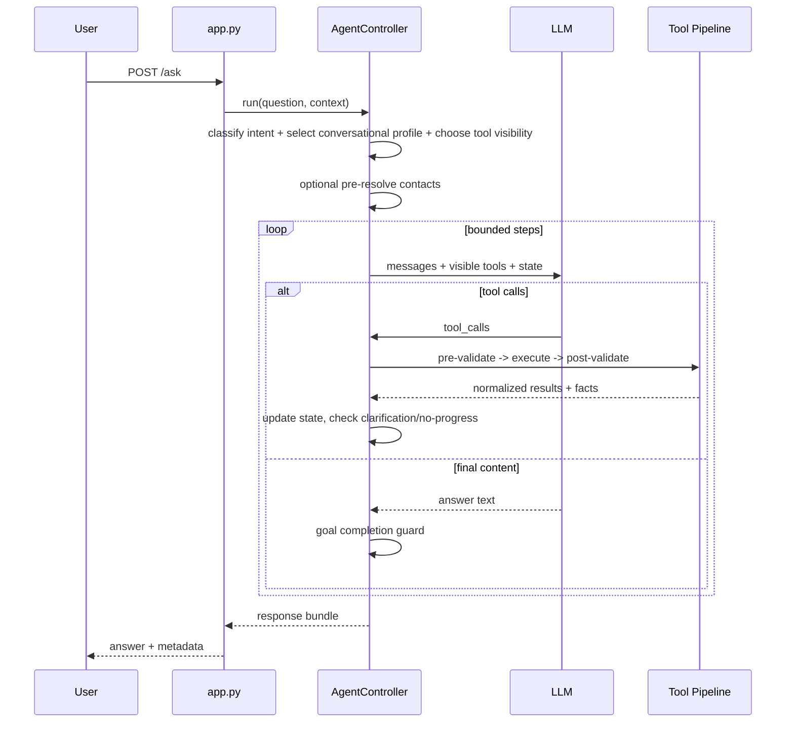

# Bounded Agent Architecture Overview

## Core Principle

**"The model proposes, the controller validates and decides."**

The LLM suggests actions, but the runtime enforces contracts, validates tool usage, and decides whether to continue, escalate, clarify, or stop.

## Runtime Layers

## Profile-Based Design

The architecture is split into shared runtime and agent-specific policy:

- `backend/orchestrator/agent/`: shared runtime primitives (controller, limits, state, visibility policy, execution pipeline).
- `backend/orchestrator/agents/registry.py`: intent-to-conversational-profile dispatch for generic `/ask` flows.
- `backend/orchestrator/agents/main/`: general conversational profile policy (fallback and non-memory intents).
- `backend/orchestrator/agents/memory_expert/`: memory-focused conversational profile for memory/data/contact intents.

Profile selection contract:

- `ConversationalAgentInterface` includes `supports_intent`.
- Registry dispatch asks each non-default profile if it supports the routed intent.
- `main` remains fallback/default when no specialized profile claims the intent.
- `backend/orchestrator/agents/daily_briefing/`: daily briefing profile, bounded tool policy, and executor integration.

## Routing and Tool Visibility

Routing is hybrid and conservative:

1. High-precision deterministic rule short-circuit when confidence is high.
2. LLM routing for open/ambiguous language.
   - Family/contact references plus personal-document artifacts (for example prescriptions, lab results, glasses specs, reports, or explicit "doc/document/file" wording) should bias toward `memory_search` with contact pre-resolution, not `web_search`.
3. Confidence-tiered tool visibility:
   - `high`: restrict to routed groups.
   - `medium`: routed groups + `resolution`.
   - `low`: full toolset (fail-open).
4. If restricted mode hits no-progress, visibility escalates to full tools in-run.

## Main Request Flow

## Key Files

| File | Purpose |
|------|---------|
| `agent/controller.py` | Main orchestration for sync/stream runs |
| `agent/tool_executor.py` | Tool execution and validation coordinator |
| `agent/tool_visibility_policy.py` | Confidence-tier visibility and escalation policy |
| `agent/state.py` | Canonical runtime state and counters |
| `agent/router.py` | Hybrid intent classification |
| `agents/registry.py` | Conversational profile selection by intent |
| `agents/main/message_builder.py` | Main prompt assembly |
| `agents/memory_expert/message_builder.py` | Memory expert prompt assembly |
| `agents/main/runtime_policy.py` | Main loop decision helpers |
| `agents/main/profile.py` | Main runtime profile |
| `agents/daily_briefing/profile.py` | Daily briefing bounded profile and tools |
| `agent/tool_loop_runner.py` | Shared bounded tool loop runner utility |

## Important Notes

- Tool groups are now used for runtime visibility policy (not just metadata).
- Clarification responses follow `need_user_input` standards and map to UI directives when possible.
- Contact resolution supports collective participant selectors (domain/company/group phrases); deterministic selectors can auto-persist contact groups, while inferred groups are surfaced in event preview and persisted on user confirmation.
- Event participant extraction keeps lowercase nickname-like entries when they appear inside explicit participant lists (for example `with Marcela, paty and bebel`), and additive follow-ups like "you forgot X" must not remove previously listed participants unless the user explicitly asks to exclude them.
- Client location context can be enriched with inferred place context (`inferred_location`) using known-place proximity and reverse geocoding fallback.
- `/event` place resolution canonicalizes extracted `where` values against existing places (including aliases) before creating new rows, and can enrich unknown places with Geoapify forward geocoding.
- `/event` datetime extraction and confirmation preserve user-stated local wall times. Naive ISO datetimes from the LLM or mobile draft editor inherit `client_context.timezone` when available rather than defaulting to UTC. Meal-only phrasing with a date but no clock time uses conventional local defaults instead of midnight: breakfast 08:30, brunch 11:00, lunch 12:30, dinner 19:30.
- `/event` structured detail extraction/update and `/contact` extraction/update use the smart chat model with high reasoning effort. Participant/contact resolution remains a separate fast/no-reasoning path and normalizes non-strict local-model JSON shapes before parsing.
- Slash-command preview/clarification state must be recoverable from persisted assistant message metadata. In-memory command preview storage is only an execution cache; mobile restore endpoints derive active `pending_event_id` from unresolved command metadata so `/event` and `/contact` cards survive app backgrounding, process restarts, and thread reloads. New command flows should either include enough model-facing confirmation data to rebuild state or attach a serializable `command_state` payload to `command_result`.
- Entity tag generation runs asynchronously after persistence. `event_tag_jobs.py`, `document_tag_jobs.py`, and `contact_tag_jobs.py` reload the saved entity, ask the shared tag manager, sanitize results, merge them with existing/user-provided tags, and refresh affected embeddings. `/event` and `/contact` extraction/update prompts must not generate tags inline.
- Meeting transcript ingest is exposed via bearer-token auth at `POST /ingest/meetings/transcript`; it requires the authenticated current user, stores the payload in the generic `async_jobs` queue, immediately acknowledges receipt, and processes the latest queued payload after a 30-second debounce. New submissions for the same meeting replace the pending job and restart the debounce. Failed processing attempts are logged and retried after one minute. Processing skips regeneration when the incoming `transcript_hash` matches the stored event raw metadata; otherwise it matches the backing calendar meeting when possible, consolidates attendee contacts by exact email/name evidence, lightly normalizes transcript segments by time-ordering and merging adjacent same-speaker fragments before summarization, injects names/aliases/emails for involved people into the summarizer prompt, sends up to 300k transcript characters to the 128k-context summarizer, stores an LLM-generated discussion summary plus structured action items while preserving the raw transcript payload in event metadata, projects action items on event detail reads, and creates linked todos for action items assigned to the authenticated user by email or identifier match.
- Meeting speaker voice matching is exposed via bearer-token auth at `POST /meetings/speakers/match`; it accepts transient per-meeting speaker embeddings, searches global contact voice profile clusters, boosts known meeting participants without restricting search, ranks each contact by its best cluster, and returns backend-owned auto-label/suggestion decisions. Durable profile training is only performed by `POST /meetings/speakers/confirm` after a user-confirmed speaker/contact assignment; confirmed embeddings update the nearest contact cluster or create a new one, unknown observations are discarded, and user corrections are stored as rejected match evidence rather than negative centroid training.
- Event photo attachments are stored as Immich asset links (`event_photos` / `event_photo_contacts`) instead of local files; mobile event uploads and mobile chat `/event` attachments are uploaded to Immich at confirmation time using original picker file bytes where possible, then linked back to the event and refreshed against Immich face/person results on later reads so delayed clustering/tagging propagates into the app.
- Proposed events are generated by the `proposed_events_daily` async worker after 15:50 UTC. The worker scans that local day of `user_location_history` using the user's latest captured timezone, creates medium/high-confidence `proposed_events` for stays of at least 15 minutes without blocking timed-event overlaps, ignores home-like/ignored places, treats all-day/full-day events as non-blocking calendar context, expires pending proposals after 7 days, and sends a push notification with `kind=proposed_events_ready` when new proposals are ready. Eligibility and overlap checks run before LLM enrichment; ambiguous timed overlaps are disambiguated against the stay's place/activity so unrelated broad events do not block proposals. Long stays spanning afternoon/evening into the next morning split at local 22:00 into a pre-sleep activity candidate and an overnight/sleep candidate when the sleep portion satisfies overnight rules; the pre-sleep activity candidate is suppressed unless it is at least 3 hours. Before storage, proposals are enriched from same-place history, linked place contacts, recurrence stats, human-readable duration/time-of-day context, and bounded public place-search context when place metadata is thin. The structured LLM enrichment produces event title/summary/people/confidence plus optional place category/summary; `suggested_summary` is editable event content while `reason` explains why the system suggested it. Suggested contacts are validated against retrieved contact IDs, thin known-place descriptions may be appended from sourced place context, and unknown places remain proposal evidence until user confirmation. Mobile review APIs live under `/mobile/proposed-events`; accepting a proposal creates a normal event.
- Daily briefing remains externally triggerable via `/agents/daily-briefing/run`, and `daily_briefing_jobs.py` also runs a polling scheduler after 05:00 UTC to enqueue and process one daily briefing per active user using the latest captured timezone when available.
- `scheduled_jobs.py` is the single source of truth for scheduled/background job metadata, including job type, worker module, UTC trigger time, poll interval, retry interval, and trigger source. `/system/jobs` and `/mobile/system/jobs` expose the registry plus worker liveness for operational checks.
- `/contact` command extraction models plural graph operations (`contacts`, `relationships`, `contact_place_links`), carries clarification conversation history plus prior extraction state into follow-up extraction, and prefers specific Title Case relationship labels plus reciprocals when context supports them. Contact previews render as a single summary card with event-style full-screen draft editing instead of inline edit forms.
- Mobile screens should reuse established screen/header patterns. Routes whose screens render their own custom or collapsing header must set `headerShown: false` in the Expo Stack route config to avoid double navigation bars.
- Contact-to-place links are stored in `contact_places` and can prioritize person-scoped place phrases (for example "Jordan's house") during `/event` resolution.
- Contact-to-document links are stored in `document_contacts` and can prioritize person-scoped document retrieval/counting for queries like prescriptions, lab reports, or glasses specs.
- Resolved place context can be persisted in assistant message metadata and reinjected for deictic follow-ups (for example "Who else lives here?") so place-aware tools use stable `place_id` references.
- Orchestrator startup auto-applies ordered SQL migrations from `backend/orchestrator/db_migrations/`; `backend/db/init.sql` remains bootstrap-only for fresh Postgres initialization. Startup also warms both configured chat models once using the shared Ollama keep-alive setting.
- Controller tracks recovery metrics in state metadata (`tool_visibility_escalations_count`, `clarification_requests_count`).
- Adaptive model routing is always enabled (`agent/model_routing.py`): routing, tagging, and contact resolution use the fast chat model with reasoning effort `none`; main agent turns use the smart chat model starting at low effort and escalating effort/timeout as complexity, step count, tool count, or low routing confidence increase. Daily briefing generation and meeting transcript summarization use the smart chat model with high effort.
- Planner/verifier checks are runtime-enforced (`agent/planning_policy.py`) before final answer completion.
- Tool execution coordinator supports parallel batches for independent read-only tool calls.
- Tool-result reinjection is budget-aware: inspected entities (for example `get_events(action=by_ids)` and `get_document`) stay raw when the prompt budget allows, while broad retrieval results are compacted only when the assembled prompt would otherwise exceed the estimated budget.
- Chat deep-link metadata (`linked_items`) is controller-derived from inspected event/document tool results; prompts can signal when inspection is worthwhile, but the model does not emit `linked_items` directly.
- User context is modeled as scoped hard rules plus soft facts in `user_facts`: hard rules are applied deterministically in handlers when possible, while soft facts are retrieved/ranked for prompt context.

## Related Docs

- [MAIN_AGENT_FLOW.md](./MAIN_AGENT_FLOW.md)
- [LINKED_ITEMS_DSL.md](./LINKED_ITEMS_DSL.md)
- [STATE_MANAGEMENT.md](./STATE_MANAGEMENT.md)
- [TOOL_GROUPS.md](./TOOL_GROUPS.md)
- [VALIDATION.md](./VALIDATION.md)
- [AGENT_LIMITS.md](./AGENT_LIMITS.md)
- [ADDING_TOOLS.md](./ADDING_TOOLS.md)
- [ADDING_INTENTS.md](./ADDING_INTENTS.md)
