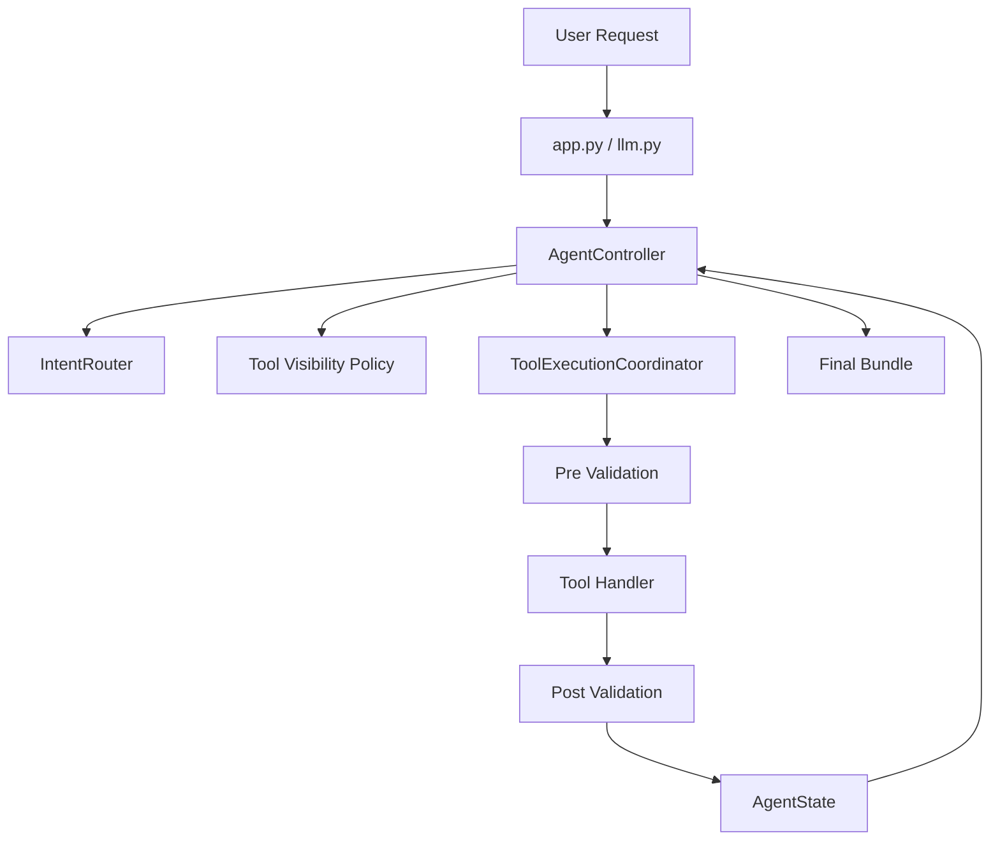
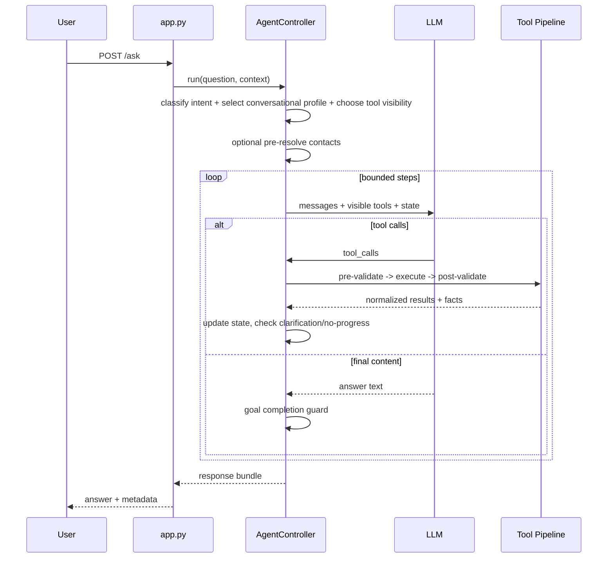

# Bounded Agent Architecture Overview

## Core Principle

**"The model proposes, the controller validates and decides."**

The LLM suggests actions, but the runtime enforces contracts, validates tool usage, and decides whether to continue, escalate, clarify, or stop.

## Runtime Layers

## Profile-Based Design

The architecture is split into shared runtime and agent-specific policy:

- `backend/orchestrator/agent/`: shared runtime primitives (controller, limits, state, visibility policy, execution pipeline).
- `backend/orchestrator/agents/registry.py`: intent-to-conversational-profile dispatch for generic `/ask` flows.
- `backend/orchestrator/agents/main/`: general conversational profile policy (fallback and non-memory intents).
- `backend/orchestrator/agents/memory_expert/`: memory-focused conversational profile for memory/data/contact intents.

Profile selection contract:

- `ConversationalAgentInterface` includes `supports_intent`.
- Registry dispatch asks each non-default profile if it supports the routed intent.
- `main` remains fallback/default when no specialized profile claims the intent.
- `backend/orchestrator/agents/daily_briefing/`: daily briefing profile, bounded tool policy, and executor integration.

## Routing and Tool Visibility

Routing is hybrid and conservative:

1. High-precision deterministic rule short-circuit when confidence is high.
2. LLM routing for open/ambiguous language.
3. Confidence-tiered tool visibility:
   - `high`: restrict to routed groups.
   - `medium`: routed groups + `resolution`.
   - `low`: full toolset (fail-open).
4. If restricted mode hits no-progress, visibility escalates to full tools in-run.

## Main Request Flow

## Key Files

| File | Purpose |
|------|---------|
| `agent/controller.py` | Main orchestration for sync/stream runs |
| `agent/tool_executor.py` | Tool execution and validation coordinator |
| `agent/tool_visibility_policy.py` | Confidence-tier visibility and escalation policy |
| `agent/state.py` | Canonical runtime state and counters |
| `agent/router.py` | Hybrid intent classification |
| `agents/registry.py` | Conversational profile selection by intent |
| `agents/main/message_builder.py` | Main prompt assembly |
| `agents/memory_expert/message_builder.py` | Memory expert prompt assembly |
| `agents/main/runtime_policy.py` | Main loop decision helpers |
| `agents/main/profile.py` | Main runtime profile |
| `agents/daily_briefing/profile.py` | Daily briefing bounded profile and tools |
| `agent/tool_loop_runner.py` | Shared bounded tool loop runner utility |

## Important Notes

- Tool groups are now used for runtime visibility policy (not just metadata).
- Clarification responses follow `need_user_input` standards and map to UI directives when possible.
- Contact resolution supports collective participant selectors (domain/company/group phrases); deterministic selectors can auto-persist contact groups, while inferred groups are surfaced in event preview and persisted on user confirmation.
- Client location context can be enriched with inferred place context (`inferred_location`) using known-place proximity and reverse geocoding fallback.
- `/event` place resolution canonicalizes extracted `where` values against existing places (including aliases) before creating new rows, and can enrich unknown places with Geoapify forward geocoding.
- `/contact` command extraction models plural graph operations (`contacts`, `relationships`, `contact_place_links`), carries clarification conversation history plus prior extraction state into follow-up extraction, and prefers specific Title Case relationship labels plus reciprocals when context supports them. Contact previews render as a single summary card with event-style full-screen draft editing instead of inline edit forms.
- Mobile screens should reuse established screen/header patterns. Routes whose screens render their own custom or collapsing header must set `headerShown: false` in the Expo Stack route config to avoid double navigation bars.
- Contact-to-place links are stored in `contact_places` and can prioritize person-scoped place phrases (for example "Jordan's house") during `/event` resolution.
- Resolved place context can be persisted in assistant message metadata and reinjected for deictic follow-ups (for example "Who else lives here?") so place-aware tools use stable `place_id` references.
- Orchestrator startup auto-applies ordered SQL migrations from `backend/orchestrator/db_migrations/`; `backend/db/init.sql` remains bootstrap-only for fresh Postgres initialization.
- Controller tracks recovery metrics in state metadata (`tool_visibility_escalations_count`, `clarification_requests_count`).
- Adaptive model routing is always enabled (`agent/model_routing.py`) and selects model/timeout per step.
- Planner/verifier checks are runtime-enforced (`agent/planning_policy.py`) before final answer completion.
- Tool execution coordinator supports parallel batches for independent read-only tool calls.
- Tool-result reinjection is budget-aware: inspected entities (for example `get_events(action=by_ids)` and `get_document`) stay raw when the prompt budget allows, while broad retrieval results are compacted only when the assembled prompt would otherwise exceed the estimated budget.
- Chat deep-link metadata (`linked_items`) is controller-derived from inspected event/document tool results; prompts can signal when inspection is worthwhile, but the model does not emit `linked_items` directly.
- User context is modeled as scoped hard rules plus soft facts in `user_facts`: hard rules are applied deterministically in handlers when possible, while soft facts are retrieved/ranked for prompt context.

## Related Docs

- [MAIN_AGENT_FLOW.md](./MAIN_AGENT_FLOW.md)
- [LINKED_ITEMS_DSL.md](./LINKED_ITEMS_DSL.md)
- [STATE_MANAGEMENT.md](./STATE_MANAGEMENT.md)
- [TOOL_GROUPS.md](./TOOL_GROUPS.md)
- [VALIDATION.md](./VALIDATION.md)
- [AGENT_LIMITS.md](./AGENT_LIMITS.md)
- [ADDING_TOOLS.md](./ADDING_TOOLS.md)
- [ADDING_INTENTS.md](./ADDING_INTENTS.md)
