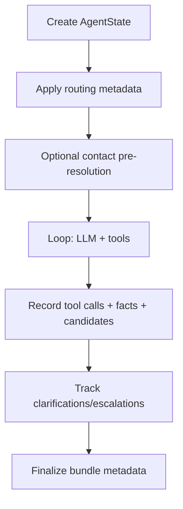

# Agent State Management

`AgentState` is the canonical controller-owned runtime state for a single request.

## Core Rule

The model never mutates state directly. Controller and tool pipeline are the only writers.

## State Model (Current)

Key groups in `backend/orchestrator/agent/state.py`:

- Task/progress: `goal`, `step_count`, `repair_count`, `tool_calls`.
- Routing metadata: `intent`, `route_source`, `route_confidence`, `route_confidence_tier`.
- Tool visibility metadata: `tool_visibility_mode`, `tool_visibility_escalated`.
- Recovery counters:
  - `tool_visibility_escalations_count`
  - `clarification_requests_count`
- Runtime context: `resolution`, `information_candidates`, `ui_directives`, `request_context`.
- Planning/verifier: `execution_plan`, `completed_plan_steps`, `verifier_notes`.
- Episodic memory: `episodic_memory` (bounded high-salience traces used for retrieval hints).

## Lifecycle

## Tool Call Records

Each execution appends a `ToolCallRecord` with:

- `tool_name`
- `arguments`
- `result`
- `duration_ms`
- `success`
- optional `error`, `validation_errors`, `was_repaired`

Treat records as append-only runtime history.

## Information Candidates

`information_candidates` stores high-signal entities (document/event/contact/etc.) so the model can reuse evidence instead of repeating broad searches.

Use helpers:

- `remember_information_candidate(...)`
- `mark_information_candidate_inspected(...)`
- `get_best_information_candidate(...)`

## Execution Plan + Verifier Notes

The controller now tracks explicit plan progress and verifier feedback:

- `set_execution_plan(...)`
- `complete_plan_step(...)`
- `add_verifier_note(...)`

These fields are injected into model context and included in run metadata.

## Episodic Memory

`episodic_memory` stores bounded, salience-weighted summaries of important tool outcomes.

Use helpers:

- `remember_episode(...)`
- `get_episodic_hints(...)`

Retrieval can consume these hints to apply small salience boosts during ranking.

## Routing + Visibility Fields

These fields are now operational, not just debug metadata:

- `route_confidence_tier` drives visibility policy.
- `tool_visibility_mode` reflects current allowed set (`restricted`, `restricted_with_resolution`, `full`, etc.).
- `tool_visibility_escalated` indicates whether runtime widened tools due to no-progress.

## Clarification Tracking

Controller increments `clarification_requests_count` when it returns:

- contact disambiguation follow-up
- UI directive follow-up

This supports analysis of ambiguity rates and UX friction.

## Context Injection

`to_context_string()` injects compact runtime context into each turn:

- goal and budgets
- routing summary
- recent facts/actions
- pending actions/questions
- top evidence candidates
- execution-plan progress + verifier notes
- top episodic memory traces
- request context availability

Prompt bloat controls are enforced by capped candidate injection.

## Contact Scope Reuse

Scoped contact resolution is stored under `state.resolution` and reused across
controller phases.

- Shared reuse-or-resolve logic lives in `backend/orchestrator/agent/contact_scope.py`.
- The same module also owns controller-side resolution state shaping, redundant-resolution blocking, and pre-resolution bookkeeping.
- The helper checks existing resolved scope first, then pending clarification, and
  only then performs an on-demand resolution attempt.
- Current controller consumers include request-level pre-resolution plus
  argument normalization for `search_memories` and `get_events`.

## Serialization

- `to_metadata()` provides compact run metadata for logs and persistence.
- `to_dict()` provides full debug serialization.

Both include routing/visibility, recovery counters, planning progress, and episodic-memory counts.

## Caveats

- State is per-request; cross-request memory belongs to storage/history layers.
- Add new empty-result formats to `_is_empty_result` semantics when introducing new tool result shapes.
- Keep state compact; large payloads should stay inside tool results, not ad-hoc state blobs.
