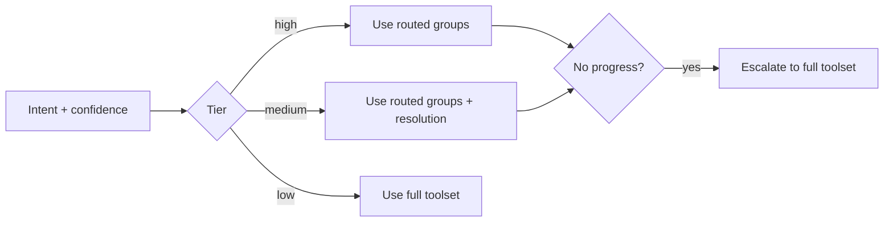

# Tool Groups Reference

Tool groups are the canonical capability taxonomy and are now used both for metadata and runtime visibility policy.

## Canonical Source

`backend/orchestrator/tools/registry.py` is the single source of truth.

```python
TOOL_GROUPS = {
    "memory": ["search_memories", "get_events", "get_document"],
    "resolution": [
        "resolve_contacts",
        "lookup_contact",
        "select_contacts",
        "lookup_places",
        "lookup_contact_places",
    ],
    "web": ["web_search", "fetch_web_page"],
    "home": ["home_assistant"],
    "skills": ["run_skill_script"],
    "ui": ["emit_ui_directive"],
    "system": ["bash"],
}
```

`agent/router.py` imports these definitions to avoid drift.

## Runtime Use (Current)

Tool groups are used by `agent/tool_visibility_policy.py` to determine visible tools from router confidence.



## Intent-to-Group Mapping

- `MEMORY_SEARCH`: `memory`, `resolution`
- `DATA_QUERY`: `memory`, `resolution`
- `CONTACT_LOOKUP`: `resolution`, `memory`
- `WEB_SEARCH`: `web`
- `HOME_CONTROL`: `home`
- `SKILL_EXECUTION`: `skills`, `memory`
- `SYSTEM_COMMAND`: `system`
- `CONVERSATIONAL`: none
- `COMPLEX` / `UNKNOWN`: all groups

## Policy Summary

- Restriction mode: conservative by default.
- High confidence narrows aggressively.
- Medium confidence keeps `resolution` available for recovery/disambiguation.
- Low confidence fails open for correctness.
- No-progress in restricted mode triggers full-tool escalation.

## Memory Tool Guidance

- Use `search_memories` for semantic discovery across events/documents/notes.
- Use `get_events` for strict event evidence:
  - `action=by_ids`: inspect specific event candidates from `search_memories`.
  - `action=by_time_span`: strict chronological windows (for example, "who did I meet most this week").
- Optional `contact_ids` on `get_events` can scope to linked contacts when identities are already resolved.

Negative examples:

- Do not use `lookup_contact` to count event interactions; it is for contact profiles/relationships.
- Use `lookup_places` / `lookup_contact_places` for place-entity resolution, not for free-form event retrieval.
- Do not rely only on event title keywords (for example only searching `meeting`) when ranking interactions across a time window.

## When Editing Groups

1. Update `TOOL_GROUPS` in `tools/registry.py`.
2. Ensure each tool contract is registered with the correct group(s).
3. Verify router mapping and tests still align.
4. Re-run integration tests for routing and visibility tiers.

## Common Pitfalls

- Updating router intent mappings without updating registry groups.
- Forgetting that medium tier always includes `resolution` by policy.
- Assuming all requests are narrowed; low confidence intentionally fails open.
