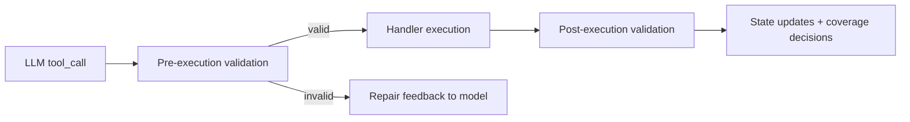

# Validation System

Validation is a two-stage pipeline around every tool call:

## Pre-Execution Validation

Source:

- `tools/contracts.py`
- `tools/validators/pre_execution.py`

Checks:

- required/unknown params
- type/range/enum rules
- custom contract validators
- targeted semantic checks (action-dependent logic)

Current semantic examples:

- `home_assistant`: `action='call_tool'` requires `tool_name`.
- `lookup_contact`: action-specific `query`/`contact_id` requirements.
- `lookup_contact_places`: requires one of `contact_id`, `contact_query`, or `group_query`.
- `lookup_place_contacts`: requires either `place_id` or `place_query`.

Repair feedback now includes:

- contract intent hints
- valid parameter guidance
- targeted semantic repair suggestions

Important runtime rule:

- Pre-validation feedback must remain visible to the model on the next turn. If a tool result is compacted for prompt-size reasons, do not compact validation/error payloads into empty success-shaped results. Preserve fields like `valid=false`, `error`, and `suggestions` verbatim so the model repairs the actual bad argument instead of retrying blindly.
- For action-scoped tools, normalize away irrelevant parameters before execution when safe. Example: `get_events(action=by_ids)` should not carry a `limit` value, because `limit` only applies to `by_time_span` retrieval.

## Post-Execution Validation

Source: `tools/validators/post_execution.py`

Checks:

- explicit failure/error detection
- empty/no-signal result detection
- extracted facts for state
- goal coverage status:
  - `SATISFIED`
  - `NEEDS_MORE_TOOLS`
  - `NEED_USER_INPUT`
  - `FAILED`

Clarification-aware behavior:

- contact ambiguity and `need_user_input` envelopes are treated as `NEED_USER_INPUT`, not generic retries.
- Validator prompts should see high-fidelity inspected evidence whenever possible. When a result is too large, use field-aware budget compaction rather than blind string truncation, and preserve the currently inspected entity's key text before dropping broad candidate context.

## Tool Contracts as Behavior Surface

Tool contracts in `tools/registry.py` now carry stronger usage guidance:

- when to use / when not to use
- parameter intent and anti-pattern hints

This reduces dependence on one giant global prompt.

## Runtime Interaction with Limits

Validation outcomes feed no-progress and escalation logic:

- repeated invalid/empty paths are detected by limit checker and state
- restricted tool visibility can escalate to full tools when no-progress is reached
- when user phrasing explicitly requests full coverage (for example "all/everyone/entire"), query handlers may treat result limits as unbounded to avoid partial truncation

## Testing Expectations

Recommended minimum tests when changing validation:

- contract schema tests (`tests/tools/test_contracts.py`)
- semantic pre-validation tests (`tests/tools/test_validators.py`)
- handler signature compatibility (`tests/tools/test_handlers/test_handler_signatures.py`)
- integration flows involving clarification and retries (`tests/integration/test_full_flow.py`)
